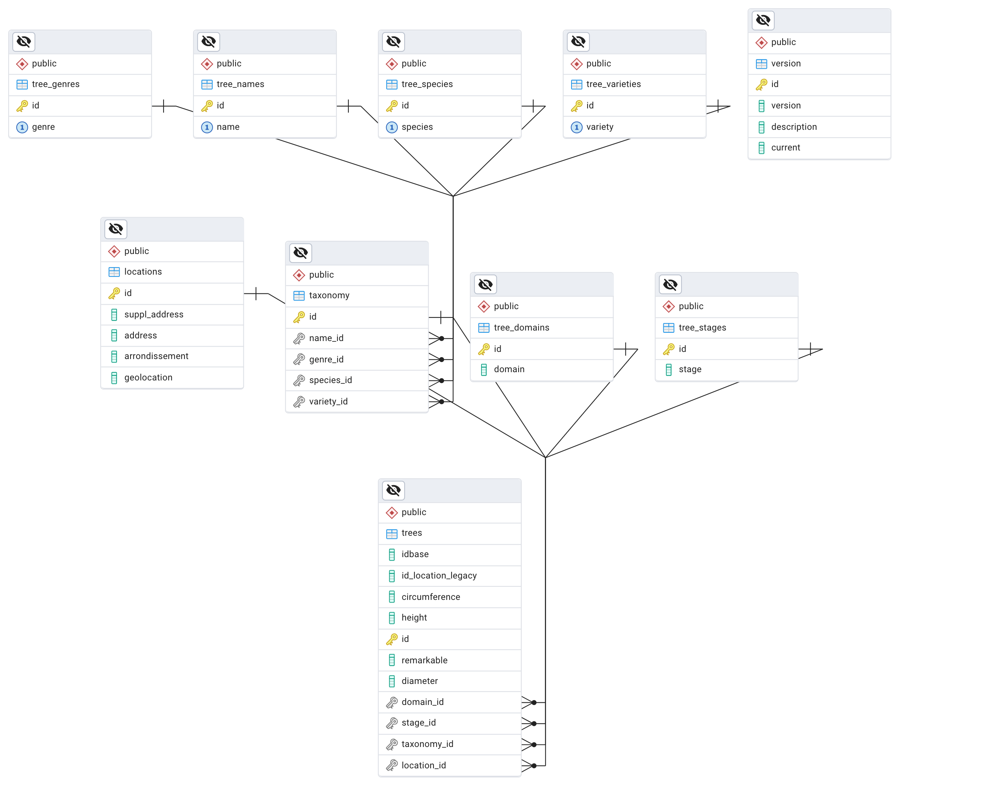

## What About Graph Databases?

SQL databases are called relational databases.

In an SQL database, the relationship between tables is explicitly defined by foreign keys between tables.

- Product -> Vegetables -> Location, Origin
- Product -> Vegetables -> Organic / not Bio
- Product -> nutrition (sugar, fat etc)
- Product -> Nutriscore labels
- Product -> ConsumeBy

And the ERD for such a database only indicates the cardinality of the relationship:

- 1 to 1
- 1 to many

When you ask an LLM to generate a diagram for a product database, it naturally adds meaningful information to the relationships between tables.

[Mermaid](https://mermaid.live) diagram

### Relationships

Graph databases like Neo4j are centered on the _meaning_ of **relationships** between entities.

**Relationships** are as important as the data itself and are explicitly stored.

These relationships have their own properties and are stored as connections.

Whereas in SQL:

- Relationships are implicit via foreign keys
- Must be reconstructed via JOINs
- Become exponentially more complex and slow when you follow multiple levels of connections

This is why Neo4j excels in questions like:

- "Find all friends of friends who like running and live in Paris"
- "What is the shortest path between person A and person B?"
- "Who are the most influential people in this network?"

Here is an example of a knowledge graph with Obsidian

