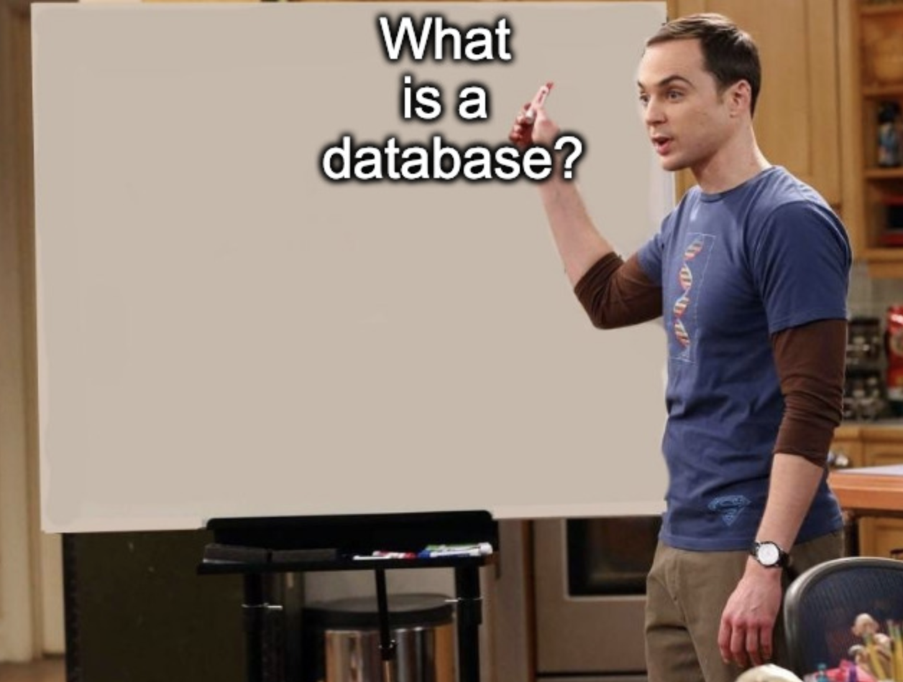
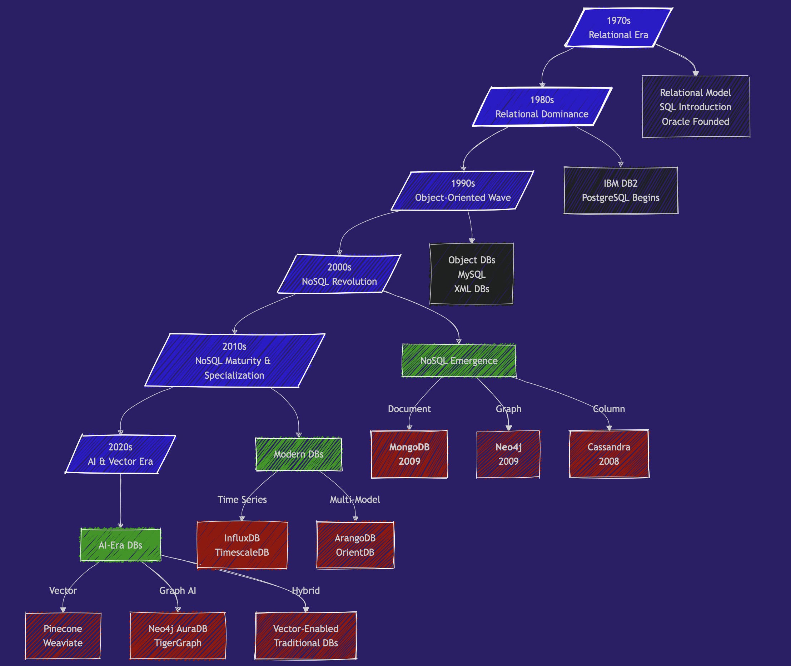
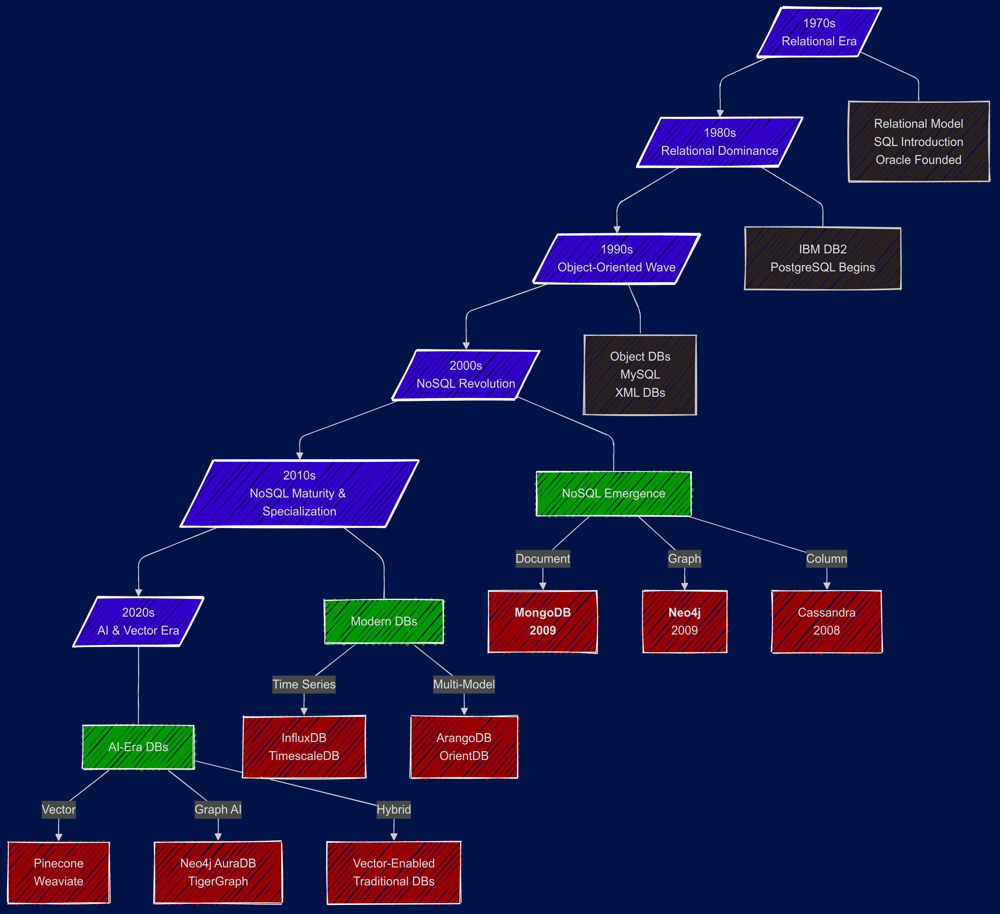
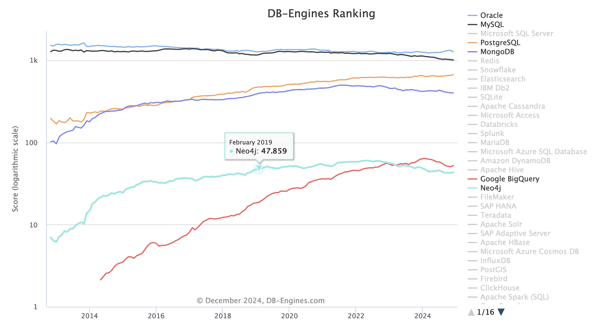

# What is a database?



Sometimes we hear the word `database` used to describe an Excel file.

How can we put something as simple as a CSV or Excel file on the same level as these engineering marvels that are PostgreSQL, Weaviate, MongoDB, Neo4j, Redis, MySQL, etc...

---

# A definition

So I asked my friend GPT-4 to give me a definition of a database:

> In simple terms:
  "A database is like a smart notebook or filing system that helps you **keep track** of lots of information and **find** exactly what you need in no time."

which definitely includes CSV files, Excel files, JSON files, XML files, and many other simple file-based formats.

---

# Another definition

From the [Encyclopedia Britannica](https://www.britannica.com/technology/database), we get:

> database, any collection of data or information specifically organized for rapid search by computer. Databases are structured to facilitate **storage**, **retrieval**, *modification*, and **deletion** of data.

See also the Database article on [Wikipedia](https://en.wikipedia.org/wiki/Database).

---
# Not only about finding data

No longer just talking about quickly finding information (the **search** part) but also about:

- storage
- modification
- deletion
- Administration.

This is where a simple spreadsheet file no longer meets the objective.

---

# use cases

**organize complex structured data**

**Spotify example**
- users, subscriptions
- devices
- songs
- artists, albums
- playlists
- plays
- etc …

---

# use cases

**Social Network example**
- users, subscriptions
- followers
- engagement
- posts
- media
- etc …

---

# use cases

**Corporate example**
- employees,
- salaries
- departments
- holidays
- etc …

---

# Why database ?

**Discussion : Why use a database instead of just … files like json, or excel / csv ?**

Take a few minutes to read these articles

This one has good links:
https://medium.com/nerd-for-tech/sql-is-one-of-the-first-things-you-should-learn-as-a-data-business-analyst-a42d1f3cfc11

https://www.geeksforgeeks.org/reasons-why-you-should-learn-sql/


---

## What we expect from a DBMS

A database management system (DBMS) is distinguished from a simple spreadsheet by several essential functionalities.

| Feature                        | Description                                                                                                 | Excel | DBMS |
| ------------------------------ | ----------------------------------------------------------------------------------------------------------- | ----- | ---- |
| **Data Storage and Retrieval** | Stores data in an organized manner and retrieves it as needed.                                              | ✅     | ✅    |
| **Data Manipulation**          | Allows adding, modifying, or deleting data.                                                                 | ✅     | ✅    |
| **Data Querying**              | Allows asking complex questions (queries) about the data.                                                   | ✔️     | ✅    |
| **Data Organization**          | Structures data in formats such as tables, documents, or graphs to facilitate management.                   | ✅     | ✅    |
| **Data Sharing**               | Allows multiple users or applications to use the database simultaneously.                                   | ✅     | ✅    |
| **Data Security**              | Protects data against unauthorized access or corruption.                                                    | ✔️     | ✅    |
| **Concurrency Control**        | Manages multiple users modifying data at the same time without conflicts.                                   |       | ✅    |
| **Backup and Recovery**        | Ensures that data is not lost and can be restored in case of failure.                                       | ✔️     | ✅    |
| **Data Integrity**             | Ensures that data remains accurate, consistent, and reliable.                                               |       | ✅    |
| **Performance Optimization**   | Provides tools to optimize the speed and efficiency of data retrievals and updates.                         |       | ✅    |
| **Support for Transactions**   | Ensures that a group of operations (transactions) is completed entirely or not at all. <br> ACID compliance |       | ✅    |

---

# A Brief History of Databases

---



---

# 1970s - The Beginning of the Relational Era

- **1970**: **[Edgar Codd](https://en.wikipedia.org/wiki/Edgar_F._Codd)** publishes "[A Relational Model of Data for Large Shared Data Banks](https://github.com/SkatAI/epita-mongodb/blob/master/pdfs/codd.pdf)"
- **1974**: **IBM** develops System R, the first SQL DBMS prototype
- **1979**: **Oracle** launches the first commercial SQL implementation

---
# 1980s - The Domination of Relational

- **1989**: Beginning of POSTGRES development (now [PostgreSQL](https://www.postgresql.org/)) at UC Berkeley
  - 🎖️🎖️🎖️ the reference SQL database.
  - now can handle no-sql & vector,
  - numerous extensions (http, postgis, ...).
  - exceptional performance.
  - and OPEN SOURCE (free, efficient, and secure).

---
# 1990s - The Object-Oriented Wave

- **1991**: Object-Oriented databases gain attention. <br> Most OODBs from the 90s are no longer used. But they influenced the evolution of both SQL and NoSQL databases.

- **1995**: MySQL is released as open source

---
# 2000s - The Beginning of the NoSQL Revolution

- 2 important papers that laid the foundations for NoSQL systems: [BigTable paper](https://research.google.com/archive/bigtable-osdi06.pdf) (Google, 2004) and [Dynamo paper](https://www.amazon.science/publications/dynamo-amazons-highly-available-key-value-store) (Amazon, 2007)

And in **2009**, 2 new NoSQL databases are launched:

- 🥭🥭🥭 MongoDB
- 🎉🎉🎉 Neo4j

---

# Why at this moment?

The rise of the world wide web (myspace - 2003 😍, youtube - 2005) and the massive increase in application scale by several orders of magnitude.

Suddenly, we have millions of people simultaneously trying to access and modify Terabytes of data in milliseconds.

Relational databases cannot keep up with the scale of applications, the chaotic nature of unstructured data, and the speed requirements.

The promise of NoSQL is **volume and speed**.

---

# 2010s - NoSQL Matures & Specialization - Big Data and Specialized Databases

- **Big Data Databases**: Systems like **Apache Hadoop** (2006) and **Apache Spark** (2009) enabled very large-scale data processing.
- **Graph Databases** gain popularity with use cases like fraud detection, knowledge graphs, and supply chain management. Neo4j and Amazon Neptune become key players.
- **Time-Series Databases (e.g., InfluxDB, TimescaleDB)**: designed for monitoring systems: IoT, logs, ...
- **Cloud Databases**: managed services like Amazon **RDS**, Google **BigQuery**, or **Snowflake**

and meanwhile, in 2013, **Docker** containers revolutionize database deployment

---

# **2020s: AI, Vector Databases, and Real-Time Needs**

- **Vector Databases** 🌶️🌶️🌶️ (e.g., Pinecone, Weaviate, Qdrant, Milvus, Faiss, ...):
  - Handle high-dimensional vector embeddings used in AI/ML applications

- and also:
  - 🌶️🌶️🌶️ **Graph + AI**: 🌶️🌶️🌶️ knowledge graphs and LLMs.
  - Multi-Model Databases that support multiple data models (document, graph, key-value) in a single system.
  - Real-Time Analytics: optimized for real-time data streaming and analytics.
  - Serverless Databases

---
# Current Trends (2025)

Vector search is booming. Vector search capabilities are being integrated into most existing DBMS, including PostgreSQL, MongoDB, and Neo4j.



---

### In Brief

- 1989: Launch of PostgreSQL
- 2009: Launch of MongoDB and Neo4j
- 2024: vector databases are in vogue while older databases integrate vector search

---

# Types of relational databases

- **Relational databases**

  - Relational (RDBMS) – Classic SQL structure (e.g. MySQL, PostgreSQL, Oracle)
  - Embedded – Runs inside apps (e.g. SQLite, H2)
  - Distributed – Scales across machines (e.g. CockroachDB, YugabyteDB)
  - Cloud-native – Built for cloud infra (e.g. Amazon Aurora, Google Spanner)
  - In-memory – Super fast, uses RAM (e.g. SAP HANA, MemSQL)
  - Columnar – Optimized for analytics (e.g. ClickHouse, Amazon Redshift)


---

# Other Types of databases

There are other types of databases than relational databases :

- **Vector database for LLMs**
  - text is transformed as a vector
  - db is optimized to retrieve similar vectors

- Document – JSON-like docs (e.g. MongoDB, Couchbase)
- Key-Value – Fast lookup via key (e.g. Redis, DynamoDB)
- Wide-Column – Columns grouped in families (e.g. Cassandra, HBase)
- Graph – Nodes + edges (e.g. Neo4j, ArangoDB)
- Time-Series – Optimized for time data (e.g. InfluxDB, TimescaleDB)
- Multi-model – Mix of types (e.g. ArangoDB, OrientDB)
- Vector: for LLMs, text transformed as a vector, optimized to retrieve similar vectors (Weaviate, Pinecone, Milvus, ..)


---
# Main Categories of Databases Today

We have many databases to choose from. It all depends on scale, application nature, budget, etc.

| Database Type             | Purpose                              | Examples                  | Application                             |
| ------------------------- | ------------------------------------ | ------------------------- | --------------------------------------- |
| **Relational - SQL**      | Fixed schema                         | PostgreSQL, MySQL, Oracle | Transactions, normalization             |
| **Document Stores**       | Flexible schema, JSON-like documents | MongoDB, CouchDB          | Web applications, content management    |
| **Graph Databases**       | Relationship-centered data           | Neo4j, ArangoDB           | Social networks, recommendation engines |
| **Key-Value Stores**      | Simple and fast lookups              | Redis, DynamoDB           | Caching, session management             |
| **Vector Databases**      | Similarity search, AI embeddings     | Pinecone, Weaviate        | AI applications, semantic search        |
| **Column-Family Stores**  | Wide-column data, high scalability   | Cassandra, HBase          | Time-series, big data applications      |
| **Time-Series Databases** | Time-ordered data                    | InfluxDB, TimescaleDB     | IoT, monitoring systems                 |

---

# Fuzzy separation

- Many databases now include vector types, and search
- postgres can do vector search, document based (json) etc


---

# Ecosystem

Check the ranking of all databases at <https://db-engines.com/en/ranking>

Trends: <https://db-engines.com/en/ranking_trend>

---



---

# Multitude of players:


source: <https://www.generativevalue.com/p/a-primer-on-databases>

Also see this interactive map that lists all players in 2023.

<https://mad.firstmark.com/>

---


---
# Open source vs closed

Open-Source Databases

Advantages

✅ Free to use

✅ Transparent (view + audit code)

✅ Customizable

✅ Strong community support

✅ No vendor lock-in

Disadvantages

❌ May need more setup & tuning

❌ Support = community or paid 3rd party

❌ Fewer enterprise features (sometimes)

---

Proprietary Databases

Advantages

✅ Enterprise-grade support

✅ Robust tooling & integrations

✅ Optimized performance at scale

✅ Security/compliance features

Disadvantages

❌ Expensive licensing

❌ Closed codebase

❌ Vendor lock-in risk

❌ Limited customization


---

# Open source always win!

---

# Wrappers

---

# Working with dbs

- directly : connect and write sql queries (psqladmin, terminal)

```sql
select * from users;
```

---

# Working with dbs: language wrapper


- via a language: python, go, node, ... ()

```python
conn = psycopg2.connect(...)
conn.cursor().execute("SELECT * FROM users")
```

---

# Working with dbs: ORM


- use an ORM (Object-Relational Mapper)
  - Python – SQLAlchemy, Django ORM
  - Ruby – ActiveRecord
  - Java – Hibernate
  - JavaScript/TS – Prisma, Sequelize

```python
users = session.query(User).all()
```

---

# Postgres

---

# Postgresql

A powerful, **open-source** relational database known for its reliability, extensibility, and advanced SQL features.

Supports complex queries, ACID compliance, full-text search, and JSON data—bridging SQL and NoSQL use cases.

Widely adopted for everything from small apps to large-scale systems,

Active community, broad tooling, and compatibility with many programming languages.

Super efficient engine: the **query planner**

---

# PostgresQL rules the world

In terms of relational databases compare
- postgreSQL
- mysql / MariaDB
- SQLite

https://opensource.com/article/19/1/open-source-databases

---

# PostgresQL and friends

**Extensions** : add-ons that enhance the functionality of a PostgreSQL database.

- provide new types of indexes, data types, procedural languages, or additional functions, thereby extending the core capabilities of PostgreSQL.

Examples include:

- **PostGIS** for geographic data,
- **pg_trgm** for text search,
- **hstore** for key-value storage.

https://www.postgresql.org/download/products/6-postgresql-extensions/

---

# SQL vs NoSQL

Let's take a step back and compare an SQL relational database and a NoSQL database.

---

# SQL

An SQL relational database (and SQL variations):

- uses a predefined **schema**: the data structure (columns, data types, etc.) is fixed.
- relational databases are efficient for complex queries, for transactions, and for ensuring data consistency (ACID compliance).

A **relational database** can be compared to a collection of well-organized spreadsheets (tables) where each column is defined, and the tables are interconnected.

---

# SQL

Tables have columns and rows of data. Each table has a unique key called a **primary key**.

Schema design relies on the concept of normalization/denormalization.
In a normalized database, information exists only in one table. A normalized database validates a series of rules called NF1, NF2, ...

> Important concept of **Normalization**: information exists in one and only one place.

---

# Hierarchy of an SQL Database:

- A unique primary key for each element in a given table
- A **foreign key** links one table to another table
- A **row** contains the value of an _entity_
- A **column** is an **attribute** or property of the _entity_
- A **table** contains all entities grouped in a fixed column structure

SQL databases = rigid, controlled, consistent data, stable.

Can be complex.

---

# NoSQL

A **non-relational database** is a flexible file system where you can store items
- of different shapes
- without strict rules.

NoSQL databases use non-relational data models, such as:

- Key-value (e.g., Redis, DynamoDB)
- Document (e.g., MongoDB, Couchbase)
- Wide-column (e.g., Cassandra, HBase)
- Graphs (e.g., Neo4j, arangodb)

---

# NoSQL

NoSQL databases encompass very different data organization systems.
A data representation based on a data graph is very different from a document-type representation like JSON where content variability is unlimited.

In all cases, we talk about **flexible schema** with unstructured or semi-structured data.
Schema flexibility allows adding new data types or changing the data structure without requiring complex migrations.

---

# NoSQL

NoSQL databases are ideal for
- **high scalability**: a system's ability to handle a significant increase in workload (data, users, transactions) while maintaining optimal performance.
  - **Vertical scalability**: increasing resources of a single server (CPU, RAM, hard drive) to handle more load.
  - **Horizontal scalability**: adding additional servers to the cluster to distribute the load.
- **Replication and partitioning**: data is distributed across multiple servers or nodes (sharding for MongoDB)
  - **Replication**: Data is copied to multiple servers to ensure availability and resilience in case of server failure.
  - **Partitioning (sharding)**: Data is divided into fragments (shards) and distributed across multiple servers.

---

# Comparison of Replication and Partitioning

Although both SQL and NoSQL databases support replication and sharding, there are key differences in their implementation and use:

| Aspect                 | SQL Databases                                                                           | NoSQL Databases                                                                             |
| ---------------------- | --------------------------------------------------------------------------------------- | ------------------------------------------------------------------------------------------- |
| Replication            | Often synchronous or asynchronous, with possible strong consistency.                    | Often asynchronous, with _eventual consistency_.                                            |
| Sharding               | More complex to implement, requires external tools or manual configurations.            | Natively integrated in many NoSQL databases (e.g., MongoDB, Cassandra).                     |
| Flexibility            | Less flexible due to rigid schema and ACID constraints.                                 | Very flexible, suited for unstructured data and varied data models.                         |
| Horizontal scalability | Possible, but often more difficult to manage due to joins and distributed transactions. | Designed from the outset for horizontal scalability, with native distributed architectures. |

---


# Conclusion

So SQL databases, called relational databases, are excellent for data structures that don't change often and where relationships between objects are stable.

NoSQL databases like MongoDB: excellent when data specifications evolve rapidly or are not definitive, flexible schema, large scale

Graph databases: the relationship is key. It's not just that there is a relationship but also what is the nature of that relationship.

- NoSQL - Document is about data scalability and evolution.
- Graph is about answering specific questions, discovering different types of meaning and insights in the data.

---

# recap

In this session, you learned:

- RDBS and the history of databases
- An overview of different types of databases
- Relational vs non-relational database


